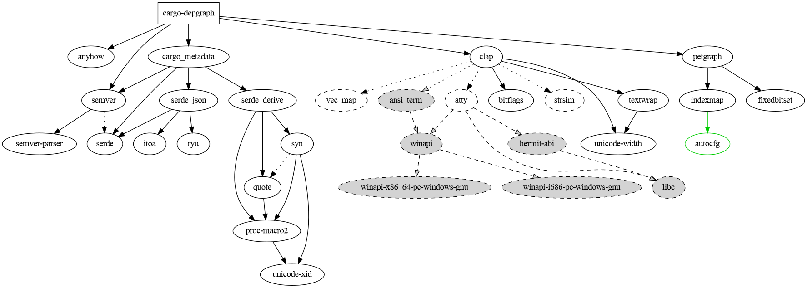
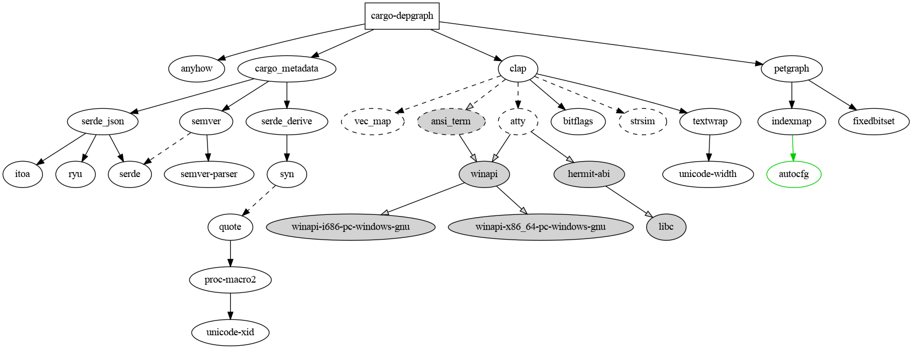

# cargo-depgraph

Creates dependency graphs for cargo projects using `cargo metadata` and graphviz.

Usage: `cargo depgraph [options] | dot -Tpng > graph.png`

Commonly useful options:

* `--all-deps`

* `--all-deps --dedup-transitive-deps`

Output explanation:

* square node = root / workspace member
* grey background = target-specific dependency
* line colors = dependency kinds w.r.t. root / workspace members
  * black = normal
  * blue = dev-dependency
  * green = build-dependency
  * light turquoise = build-dependency of a dev-dependency
  * dark green = both normal and build-dependency
  * violet = both dev-dependency and build-dependency
  * … not seen in the wild yet, but theoretically possible:
    * dark turquoise = both normal and build-dependency of a dev-dependency
    * pastel blue = both dev-dependency and build-dependency of a dev-dependency
  * red = you broke it
